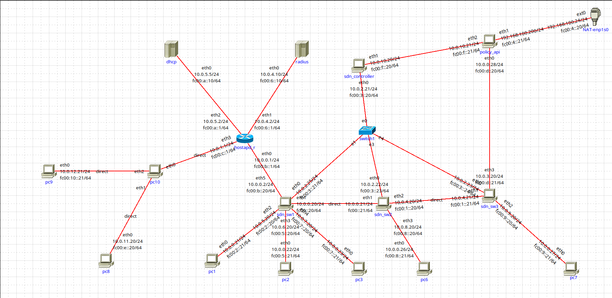
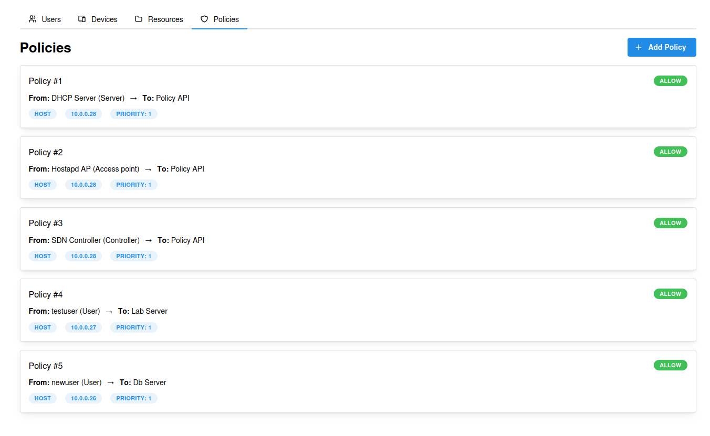

# SDN Zero Trust Network s IMUNES-om

**Implementacija Zero Trust Network arhitekture u IMUNES mrežnom emulatoru korištenjem SDN principa i Ryu kontrolera.**

[](https://github.com/matej-jurisic/sdn-ztn-imunes)

---

## Uvod

Ovaj projekt implementira **Zero Trust Network (ZTN)** arhitekturu unutar **IMUNES** mrežnog emulatora koristeći **SDN (Software-Defined Networking)** principe. Sustav se temelji na dinamičkom upravljanju mrežnim politikama i autorizaciji korisnika putem Ryu SDN kontrolera te Policy dashboarda koji u stvarnom vremenu komunicira s mrežnom infrastrukturom.

---

## Značajke / Funkcionalnosti

-   **Zero Trust politike**: Pristup resursima kontrolira se po korisniku i uređaju — svaki zahtjev za pristupom mora biti eksplicitno autoriziran.
-   **SDN upravljanje prometom**: Open vSwitch čvorovi upravljani su centralnim Ryu kontrolerom koji dinamički instalira flow pravila na temelju aktivnih politika.
-   **802.1X autentikacija**: Vanjski klijenti pristupaju mreži putem hostapd pristupne točke i RADIUS servera.
-   **Policy Manager sučelje**: Web sučelje za upravljanje korisnicima, uređajima, resursima i pravilima pristupa u stvarnom vremenu.
-   **Dinamičko ažuriranje pravila**: Izmjena politike u Policy Manageru automatski obavještava SDN kontroler koji propagira promjene na sve relevantne switcheve.

---

## Korištene Tehnologije / Alati

-   **Mrežna emulacija**: IMUNES
-   **SDN**: Open vSwitch, Ryu kontroler (Python), OpenFlow 1.3
-   **Autentikacija**: hostapd, FreeRADIUS, 802.1X
-   **Backend (Policy API)**: .NET / ASP.NET Core
-   **Frontend (Policy Manager)**: Vite (port 5173)
-   **Infrastruktura**: Docker, DHCP

---

## Grupni projekt

Ovaj projekt je grupni rad izađen na FER-u. Na projektu su sudjelovali Danijel Živković, Ivona Tomašić, Janom Komerički, Karlo Baljak i Lovro Kekez.

### Moje odgovornosti

- Dizajn i implementacija Policy API-ja i Policy Managera
- Ryu kontroler — pronalazak puteva i instalacija flow pravila na inicijalne zahtjeve
- DHCP
- Komunikacija hostapd <-> policy-api
- Komunikacija dhcp <-> policy-api
- Povezivanje svih dijelova sustava u cjelinu

---

## Topologija mreže



| Grupa | Čvorovi | Uloga |
| --- | --- | --- |
| **PC uređaji (interni)** | pc1, pc2, pc3, pc6, pc7 | Interni klijenti s statičkim adresama |
| **PC uređaji (vanjski)** | pc8, pc9 | Vanjski klijenti s 802.1X autentikacijom i DHCP adresama |
| **Bridge** | pc10 | Spaja hostapd pristupnu točku s vanjskim klijentima |
| **SDN switchevi** | sdn_sw1, sdn_sw2, sdn_sw3 | Open vSwitch, upravljani SDN kontrolerom |
| **SDN kontroler** | sdn_controller | Centralno upravljanje flow pravilima |
| **Tradicionalni LAN switch** | switch1 | Layer 2 komunikacija u LAN segmentu |
| **DHCP server** | dhcp | Dodjela IP adresa |
| **RADIUS server** | radius | 802.1X autentikacija korisnika |
| **Policy / API server** | policy_api | Upravljanje mrežnim politikama |
| **Router / Hostapd AP** | hostapd_r | Pristupna točka i DHCP relay |
| **External / NAT gateway** | ext1 | Pristup Policy API-ju s host sustava |

---

## Instalacija / Pokretanje

### Preduvjeti

Izgraditi Docker slike u korijenskom direktoriju projekta:

```bash
sudo docker build -f Dockerfile.controller -t imunes/sdn:controller .
sudo docker build -f Dockerfile.hostapd -t imunes/sdn:hostapd .
sudo docker build -f Dockerfile.openvs -t imunes/sdn:openvs .
sudo docker build -f Dockerfile.device -t imunes/sdn:device .
sudo docker build -f Dockerfile.radius -t imunes/sdn:radius .
sudo docker build -f Dockerfile.policy -t imunes/sdn:policy .
```

Provjeriti je li učitan `openvswitch` modul:

```bash
lsmod | grep openvswitch
```

Ako je ispis prazan, učitati modul:

```bash
sudo modprobe openvswitch
echo openvswitch | sudo tee /etc/modules-load.d/openvswitch.conf
```

Pokrenuti simulaciju:

```bash
sudo imunes simple_sdn.imn
```

### Pokretanje

**1. Pokretanje SDN kontrolera** na čvoru `sdn_controller`:

```bash
source ryu-env/bin/activate
ryu-manager main.py
```

**2. Autentikacija vanjskih klijenata** na čvorovima `pc8` i `pc9`:

```bash
# pc8
/authenticate.sh testuser testing123

# pc9
/authenticate.sh newuser newuser123
```

Skripta obavlja redom: hostapd autentikaciju, DHCP dodjelu adrese i registraciju u Policy API.

### Policy Manager

Web sučelju dostupnom na portu **5173** možete pristupiti s host sustava ako je IP adresa `policy` čvora (eth1) rutabilna. Sučelje omogućuje:

- Pregled i upravljanje korisnicima, uređajima, resursima i politikama
- Dodavanje novih entiteta
- Izmjenu postojećih politika (allow/deny) s trenutnim učinkom na mrežni promet



Tipičan workflow za dodavanje novog pristupa:
1. **Users** — dodati korisnika
2. **Devices** — dodati uređaj i dodijeliti korisnika
3. **Resources** — dodati resurs
4. **Devices** → "Assign to Resource" — dodijeliti resurs uređaju
5. **Policies** — kreirati politiku između korisnika i resursa

---

Autor: _Matej Jurišić_  
Email: [mjurisic812@gmail.com](mailto:mjurisic812@gmail.com)

Datum: 17/06/2025  
Licenca: MIT  
Repozitorij: [github.com/matej-jurisic/sdn-ztn-imunes](https://github.com/matej-jurisic/sdn-ztn-imunes)
